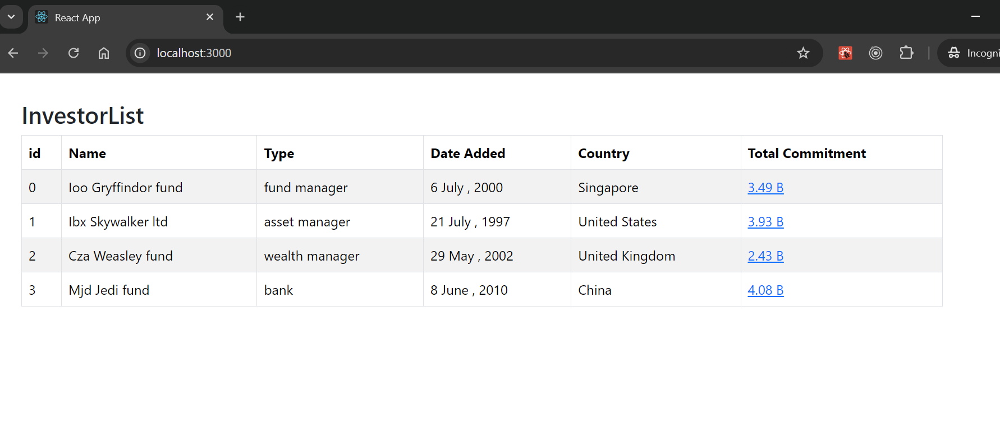
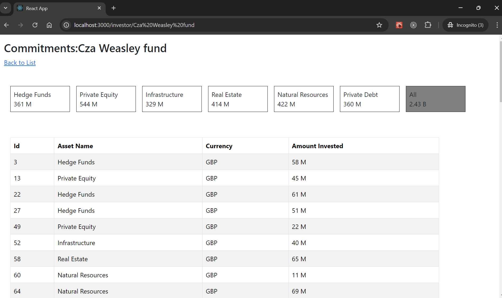

# Investor App

Prequin Investor UI App provides investment details

## Table of Contents

- [Technologies Used](#technologies-used)
- [Demo](#demo)
- [Getting Started](#getting-started)
- [Installation](#installation)

## Demo

Home Page


Investor Detail page


## Technologies Used

- [React](https://reactjs.org/) - A JavaScript library for building user interfaces
- [React Router](https://reactrouter.com/) - For routing in React applications

## Getting Started

### Prerequisites

Make sure you have the following installed:

- [Node.js](https://nodejs.org/) (version 14 or above)
- [npm](https://www.npmjs.com/) (comes with Node.js) or [Yarn](https://yarnpkg.com/) (optional)

### Installation

1. Clone the repository:

   ```bash
   git clone https://github.com/Karthik-081-keyan/Prequin-UI-App.git
   ```

2. Pull the latest changes:

   ```bash
   git pull
   ```

3. Checkout the main branch:

   ```bash
   git checkout main
   ```
